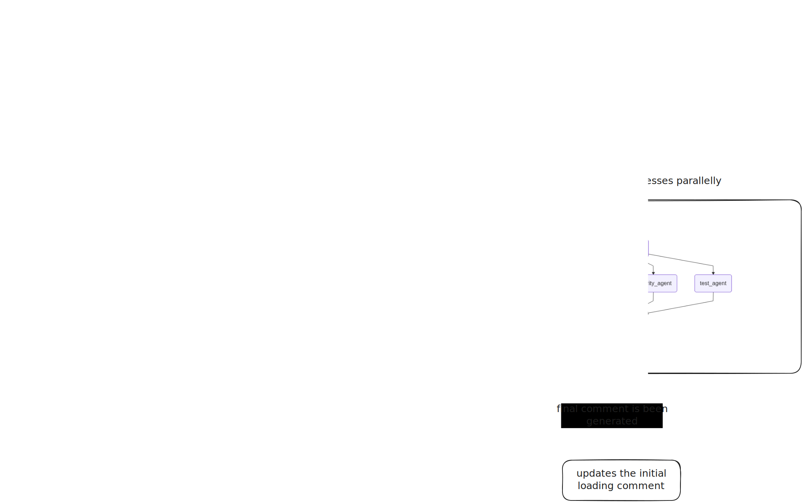

## High-level architecture

The following diagram illustrates the high-level architecture of the **CodeDaddy PR Review Workflow**, showing how pull requests and commits are processed asynchronously and analyzed by multiple AI agents in parallel.

### Overview

1. **Webhook Trigger** — When a Pull Request or Commit event occurs, a webhook receives the event payload.  
2. **Background Processing** — The event is pushed into a Python RQ (Redis Queue) background job (`GITHUB_PR_PROCESS`).  
3. **Workers** — Multiple workers clone the repository, parse source files, build semantic graphs, and prepare contextual data.  
   - Each worker uploads its processed context to S3.  
4. **Context Initialization** — A controller process downloads context from S3 and sets up the state for LangGraph nodes.  
5. **Parallel Agent Execution** — Several agents run concurrently:
   - `code_quality_agent`  
   - `performance_agent`  
   - `security_agent`  
   - `test_agent`  
6. **Aggregation Phase** — The `aggregator_agent` combines insights from all agents.  
7. **Comment Update** — The aggregated output replaces the initial loading comment with a comprehensive final PR review comment.

---

### Key Characteristics

- **Event-driven:** Triggered by GitHub webhooks.  
- **Asynchronous:** Uses background workers for parallel processing.  
- **Scalable:** Each worker operates independently.  
- **AI-powered:** Multi-agent architecture performs different aspects of code analysis.  
- **Automated Feedback:** Automatically updates PR comments with contextual insights.

---

